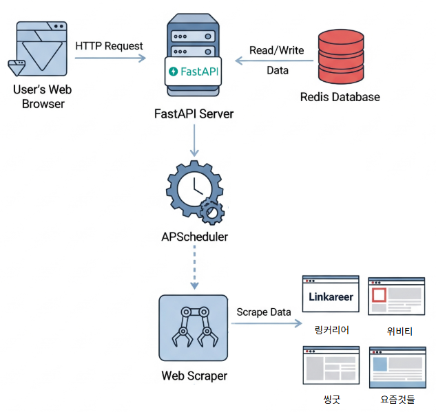

# Scraping_contest
웹 스크래핑 기반 공모전 정보 제공 서비스

## 프로젝트 개요
이 프로젝트는 **FastAPI**와 **Redis**를 활용해 여러 웹사이트에서 IT 관련 공모전 정보를 실시간으로 수집하고, 사용자에게 웹 페이지 형태로 제공하는 서비스. 공모전 정보는 매일 자동 업데이트 후 사용자에게 항상 최신 정보를 제공.

## 주요 기능
* **실시간 웹 스크래핑**: '요즘것들', '링커리어', '위비티', '씽굿' 총 4개 공모전 정보 사이트에서 IT 관련 공모전 데이터를 스크래핑 한 뒤 데이터베이스에 저장.
* **데이터 정제 및 저장**: 중복을 방지 및 마감된 공모전을 자동으로 삭제.
* **자동 업데이트 스케줄러**: **APScheduler**를 사용하여 하루에 한 번씩 정해진 시간에 공모전 정보를 자동으로 업데이트.
* **웹 서비스 제공**: **FastAPI**를 이용해 수집된 정보를 카드형 웹 페이지(`index.html`)로 사용자에게 제공.
* **스크래핑 진행 상황 모니터링**: 데이터 수집이 진행 중일 때 사용자에게 진행 상태를 시각적으로 보여주는 페이지(`scraping.html`)를 제공.

## 시스템 아키텍처

## 사용 기술 스택
| 구분 | 기술 스택 | 설명 |
| :--- | :--- | :--- |
| **백엔드** | `Python`, `FastAPI` | API 서버 구축 및 비동기 작업 관리 |
| **데이터베이스** | `Redis` | 수집된 공모전 정보 저장 및 관리 |
| **웹 스크래핑** | `BeautifulSoup4`, `Playwright`, `Selenium` | 각 사이트의 특성에 맞춰 웹 데이터 추출 |
| **자동화** | `APScheduler` | 매일 정해진 시간에 스크래핑 작업을 실행하는 스케줄러 기능 구현 |
| **프론트엔드** | `HTML5`, `Tailwind CSS` | 공모전 정보를 표시하는 웹 페이지 구성 |